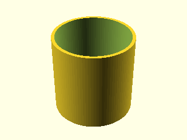
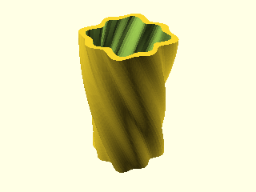

# OpenSCAD MCP Server

A Model Context Protocol (MCP) server that provides OpenSCAD rendering capabilities. This server allows you to render OpenSCAD code to PNG images through a standardized MCP interface.

## Features

- **Headless OpenSCAD Rendering**: Execute OpenSCAD code and generate PNG images without a GUI
- **Flexible Camera Control**: Support for custom camera positioning and orientation
- **Cross-Platform**: Configurable OpenSCAD binary path for different operating systems

## Prerequisites

- **Node.js**: Version 18 or higher
- **OpenSCAD**: Nightly (dev) version must be installed on your system. Download and install from [OpenSCAD.org](https://openscad.org).

## Installation

1. Clone this repository:
   ```bash
   git clone <repository-url>
   cd openscad-mcp
   ```

2. Install dependencies:
   ```bash
   npm install
   ```

3. Build the project:
   ```bash
   npm run build
   ```

## Configuration

### OpenSCAD Binary Path

By default, the server looks for OpenSCAD at `/Applications/OpenSCAD.app/Contents/MacOS/OpenSCAD` (macOS path). You can customize this by setting the `OPENSCAD_BINARY` environment variable.

## Usage as MCP Server in Gemini-cli


In your gemini settings.json file, e.g., `~/.gemini/settings.json`, add the following:

```json
  "mcpServers": {
    "openscad": {
      "command": "node",
      "args": ["/path/to/openscad-mcp/dist/index.js"],
      "env": {
        "OPENSCAD_BINARY": "/path/to/OpenSCAD/binary"
      }
    }
  }
```

Use included `GEMINI.md` file in the folder you want to generate openSCAD code in.

## Available Tools

### `render_openscad`

Renders OpenSCAD code to a PNG image file.

**Parameters:**
- `code` (string, required): The OpenSCAD code to render
- `output_path` (string, required): Path where the rendered PNG image should be saved
- `camera` (string, optional): Camera parameters in one of these formats:
  - `translate_x,y,z,rot_x,y,z,dist` - Translation, rotation, and distance
  - `eye_x,y,z,center_x,y,z` - Eye position and center point

**Example Request:**
```json
{
  "jsonrpc": "2.0",
  "id": 1,
  "method": "tools/call",
  "params": {
    "name": "render_openscad",
    "arguments": {
      "code": "cube([20, 30, 10]); translate([25, 0, 0]) sphere(r=8);",
      "output_path": "/tmp/my_render.png",
      "camera": "0,0,0,60,0,315,100"
    }
  }
}
```

**Response:**
```json
{
  "jsonrpc": "2.0",
  "id": 1,
  "result": {
    "content": [
      {
        "type": "text",
        "text": "OpenSCAD rendering completed successfully\n\nOutput:\n...\n\nRendered image saved to: /tmp/my_render.png"
      }
    ]
  }
}
```

## Examples with gemini-cli

Prompt:
```
Generate openscad code for a very beautiful and unique planter. Iterate as many times as possible on the design, looking at the rendering in each iteration and improving it. The goal is to generate a unique and aesthetic planter design amenable for 3D printing.
```

|  | 
|:--:| 
| *First Iteration* |
|  | 
| *Final Iteration* |

Generated OpenSCAD code:

```javascript

module unique_planter(
    height = 100,
    width = 50,
    wall_thickness = 4,
    twist = 90,
    freq = 8,
    amp = 2,
    drainage_hole_rad = 5
) {
    $fn=100;
    difference() {
        linear_extrude(height = height, scale = 1.2, twist = twist, slices = 200) {
            polygon([
                for (a = [0:360/$fn:359])
                let (r = width/2 + amp*sin(a*freq) + amp*sin(a*freq/2))
                [r*cos(a), r*sin(a)]
            ]);
        }
        translate([0,0,wall_thickness]) {
            linear_extrude(height = height, scale = 1.2, twist = twist, slices = 200) {
                polygon([
                    for (a = [0:360/$fn:359])
                    let (r = width/2 - wall_thickness + amp*sin(a*freq) + amp*sin(a*freq/2))
                    [r*cos(a), r*sin(a)]
                ]);
            }
        }
        translate([0,0,-1]) {
            cylinder(h = wall_thickness+2, r = drainage_hole_rad);
        }
    }
}

unique_planter();
```


## Testing

Run the included tests to verify everything works:

```bash
node test_client.js
```

## Development

### Scripts

- `npm run build`: Compile TypeScript to JavaScript
- `npm run start`: Start the MCP server
- `npm run dev`: Watch mode for development

### Project Structure

```
openscad-mcp/
├── src/
│   └── index.ts          # Main MCP server implementation
├── dist/                 # Compiled JavaScript output
├── test_client.js        # Basic test client
├── test.scad            # Sample OpenSCAD file
├── package.json         # Node.js dependencies and scripts
├── tsconfig.json        # TypeScript configuration
└── README.md           # This file
```

## Troubleshooting

### OpenSCAD Not Found
```
Error: spawn /Applications/OpenSCAD.app/Contents/MacOS/OpenSCAD ENOENT
```
**Solution**: Verify OpenSCAD is installed and set the correct `OPENSCAD_BINARY` path.

### Permission Denied
```
Error: EACCES: permission denied, open '/path/to/output.png'
```
**Solution**: Ensure the output directory exists and is writable.

### Rendering Timeout
```
Error: Command failed: timeout
```
**Solution**: Simplify your OpenSCAD code or increase the timeout in the source code.

## Contributing

1. Fork the repository
2. Create a feature branch
3. Make your changes
4. Add tests for new functionality
5. Submit a pull request

## Links

- [OpenSCAD Documentation](https://openscad.org/documentation.html)
- [Model Context Protocol Specification](https://spec.modelcontextprotocol.io/)
- [OpenSCAD Download](https://openscad.org/downloads.html)
